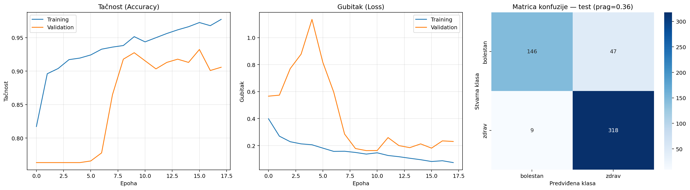
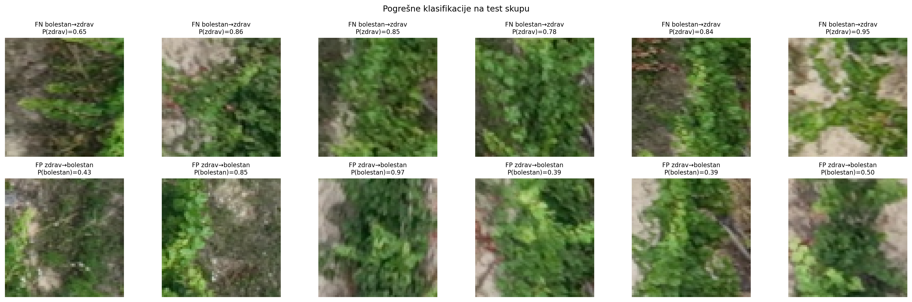

# ESCA-Disease-Detection-in-Vineyards-Using-CNN-on-Drone-RGB-Imagery

## Overview

This project implements a lightweight CNN classifier that distinguishes **diseased** (ESCA / mixed-ESCA) from **healthy** grapevine patches extracted from drone-captured RGB orthophotos. The pipeline reads LabelMe-format JSON annotations, extracts and resizes image patches, applies scene-wise data splitting to prevent data leakage, and trains a binary classifier with threshold tuning optimised for disease recall (F2 score).

### Key features

- **Scene-level train / validation / test split** — no patches from the same drone image appear in more than one subset, ensuring unbiased evaluation.
- **Automatic healthy-patch extraction** — healthy samples are mined from annotated images using an HSV green-vegetation mask with a configurable exclusion buffer around diseased regions.
- **Train-only class balancing** — random undersampling equalises classes only in the training set; validation and test sets keep their natural distribution.
- **Threshold tuning on validation** — the decision threshold is selected by maximising the F2 score for the diseased class on the validation set, then applied once to the held-out test set.

## Model architecture

| Block | Layers | Output |
|-------|--------|--------|
| Conv block 1 | Conv2D(32, 3×3) → BatchNorm → MaxPool(2×2) | 32 × 32 × 32 |
| Conv block 2 | Conv2D(64, 3×3) → BatchNorm → MaxPool(2×2) | 16 × 16 × 64 |
| Conv block 3 | Conv2D(128, 3×3) → BatchNorm → MaxPool(2×2) | 8 × 8 × 128 |
| Head | GlobalAvgPool → Dense(64, ReLU) → Dropout(0.5) → Dense(2, softmax) | 2 |

**Total parameters:** ~102 K (400 KB) — input size 64 × 64 × 3 RGB.

## Results

| Metric | Default threshold (0.50) | Tuned threshold (0.36) |
|--------|:------------------------:|:----------------------:|
| **Accuracy** | 88.46 % | **89.23 %** |
| **Precision (diseased)** | 96.50 % | 94.19 % |
| **Recall (diseased)** | 71.50 % | **75.65 %** |
| **F1 (diseased)** | 82.14 % | **83.91 %** |

Confusion matrix (tuned threshold, test set):

|  | Pred. diseased | Pred. healthy |
|--|:-:|:-:|
| **True diseased** | 146 | 47 |
| **True healthy** | 9 | 318 |

<details>
<summary>Training curves & confusion matrix</summary>


</details>

<details>
<summary>Misclassification examples</summary>


</details>

## Repository structure

```
esca-cnn-detection/
├── README.md
├── requirements.txt
├── .gitignore
├── classification.py                  # Full pipeline: extraction → training → evaluation
│
├── results/
│   ├── rezultati.png              # Accuracy / loss curves + confusion matrix
│   ├── primeri_test.png           # Random test-set examples per class
│   ├── greske_test.png            # Misclassified patches with probabilities
│   ├── classification_report.txt  # Precision / recall / F1 at both thresholds
│   ├── per_scene_rezultati.csv    # Per-scene accuracy breakdown
│   ├── threshold_validation.csv   # Threshold sweep on validation set
│   └── scene_split.txt            # Which scenes ended up in train / val / test
│
├── model/
│   ├── best_model.keras           # Weights from the epoch with lowest val_loss
│   └── model_summary.txt          # Layer-by-layer summary
│
└── data/
    └── README.md                  # Expected dataset structure (data not included)
```

## Dataset

The dataset consists of high-resolution RGB drone images of vineyards (DJI), annotated in [LabelMe](https://github.com/labelmeai/labelme) JSON format. Images come from three vineyard sites (`vinarija2`, `vinarija3`, `vinarija4`) captured in July–August 2024.

**The dataset is not included in this repository** due to its size and data-sharing restrictions. See [`data/README.md`](data/README.md) for the expected folder layout.

## Getting started

### Prerequisites

- Python 3.10+
- A machine with at least 8 GB RAM (GPU optional but recommended)

### Installation

```bash
git clone https://github.com/<your-username>/esca-cnn-detection.git
cd esca-cnn-detection
pip install -r requirements.txt
```

### Running the pipeline

Place the LabelMe JSON dataset under `dataset_json/` (or any folder) and run:

```bash
python classification.py
```

To point at a custom dataset location:

```bash
python  classification.py --dataset_json path/to/folder1 path/to/folder2
```

The script will:
1. Extract and resize patches from annotated images.
2. Split scenes into train / validation / test sets.
3. Train the CNN with early stopping and learning-rate reduction.
4. Tune the classification threshold on the validation set.
5. Evaluate on the test set and save all result files.

### Reproducing results

All random operations use `seed=42`. With the same dataset and the same package versions (see `requirements.txt`), results should be reproducible up to minor floating-point differences across hardware.

## Configuration

Key hyperparameters are set in the `CONFIG` dictionary at the top of `classification.py`:

| Parameter | Default | Description |
|-----------|---------|-------------|
| `patch_size` | 64 | Patch dimensions (px) |
| `epochs` | 30 | Maximum training epochs |
| `batch_size` | 16 | Mini-batch size |
| `learning_rate` | 0.0003 | Initial Adam learning rate |
| `test_fraction` | 0.20 | Fraction of scenes reserved for test |
| `val_fraction` | 0.15 | Fraction of scenes reserved for validation |
| `disease_labels` | `{eska, meska}` | LabelMe labels treated as diseased |
| `healthy_min_green` | 0.70 | Minimum green-pixel ratio for healthy patches |

## License

This project was developed as a university diploma thesis. The code is provided for educational and research purposes.
